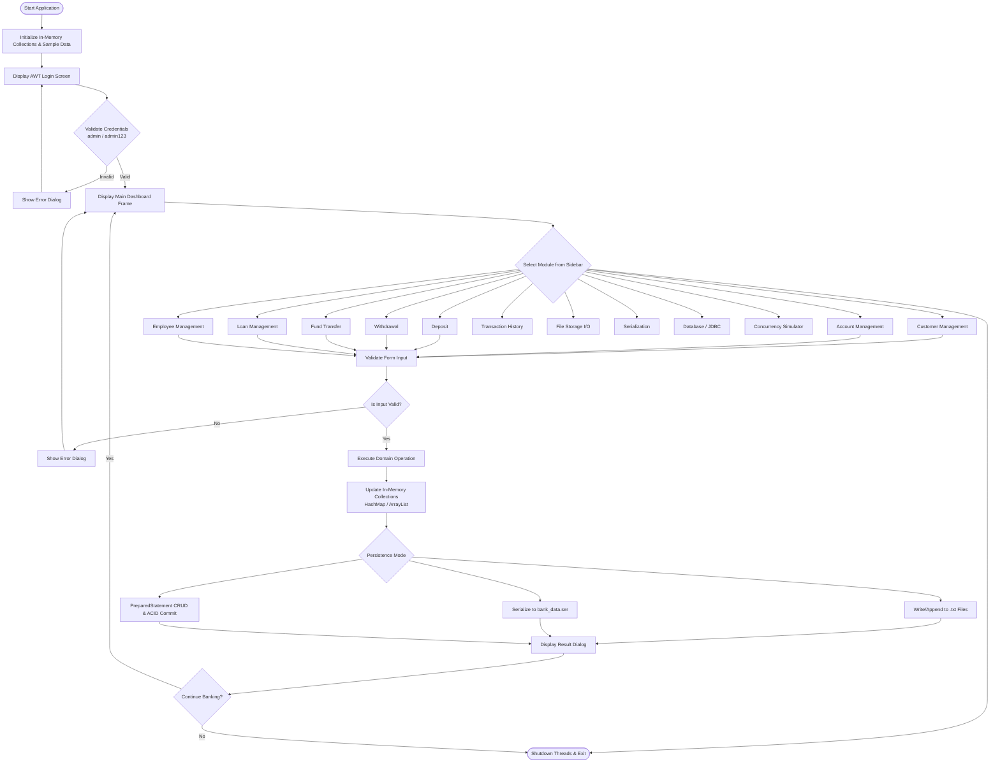
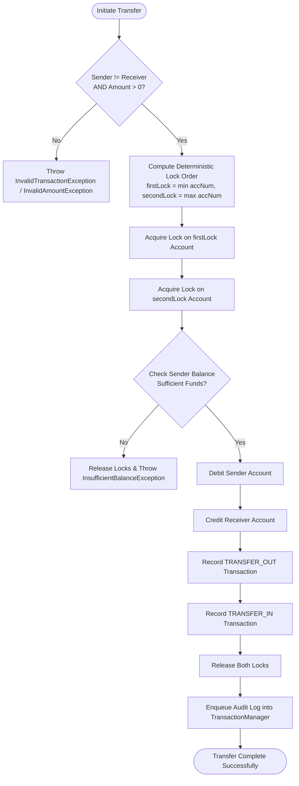
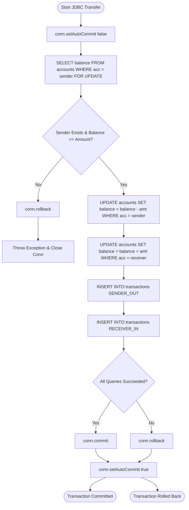

# Smart Bank Management System - System Flowcharts

## 1. Master Application Flowchart

---

## 2. Fund Transfer Flowchart (Multithreading & Synchronization)

---

## 3. JDBC Transactional Transfer Flowchart (ACID)

